<h1>《学生管理系统》</h1>

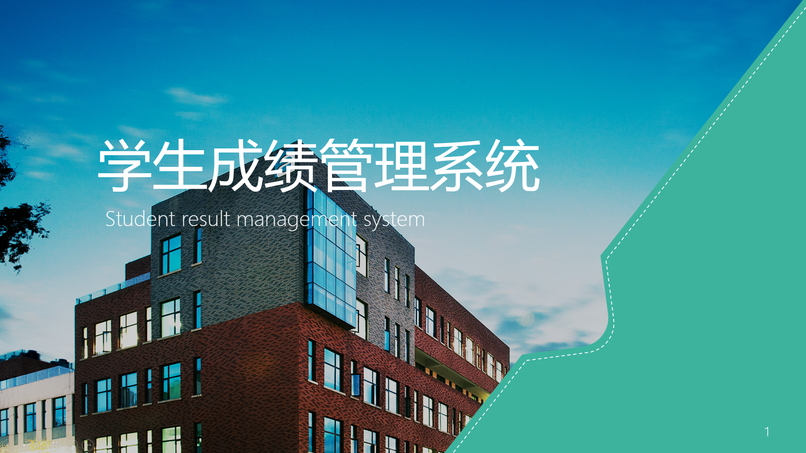  

> **项目背景**  
本系统主要应用于教育系统，完成对日常的教育工作中学生成绩档案的数字化管理。开发本系统可以使学校教职员工减轻工作压力，比较系统的对教务、教学上的各项服务和信息进行管理，同时，可以减少劳动力的使用，加快查询速度，加强管理，使各项管理更加规范化。  
目前，学校工作繁杂，资料众多，虽然各类管理信息系统已经进入高校，但还未普及，而对于学生成绩管理来说，目前还没有一套完整、统一的系统。因此，开发一套适合大众的、兼容性好的系统是有必要的。本系统在开发过程中，使其符合操作的业务流程，并力求系统的全面性、通用性。

>**项目简介:**   
>学生成绩管理系统通过对教务管理所需的信息管理，把管理人员从繁琐的数据计算中解脱出来，为老师节省了很多时间和精力，提高老师的工作效率，通过学生成绩管理系统给学校管理者减轻工作的负担，将工作的失误几率降低到最低，为广大来时同学带来便利，使信息共享性大大增强。同时这个系统还可以减少人力与管理费用，提供信息准确度更高更简便的学生成绩管理系统。

> **项目环境及相关配置:**   
>(1)Tomcat 8.0  
(2)Mysql 5.5  
(3)Layui前端框架  
(4)GitHub项目的托管平台  
(5)IntellijIDEA2017.1.2  
(6)Maven高级项目管理  

> **系统流程图：**  

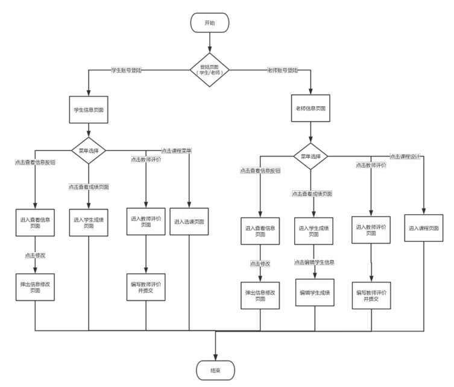
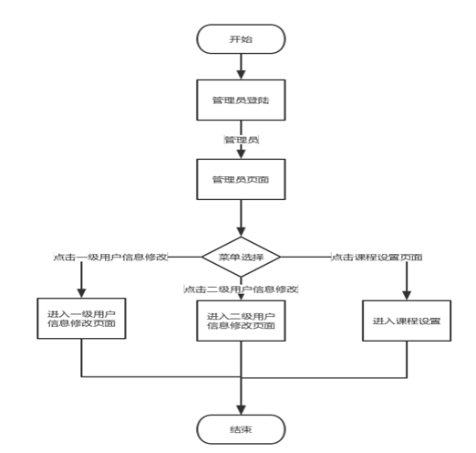
> **系统功能层次:**  

> **学生登陆界面**  

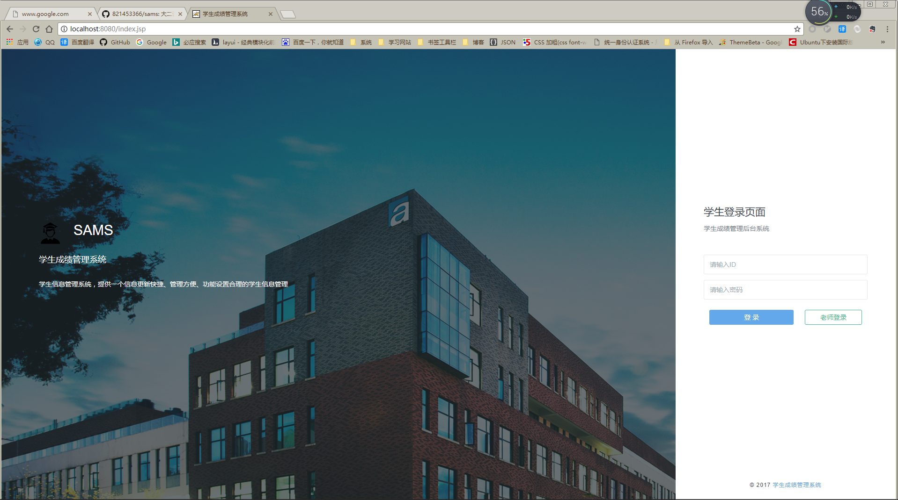

> **学生操作界面：**

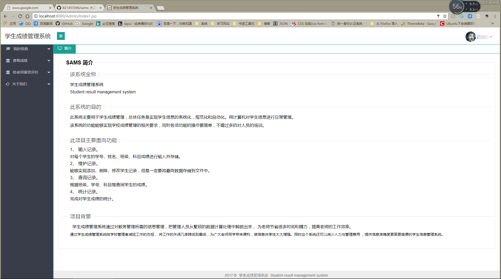

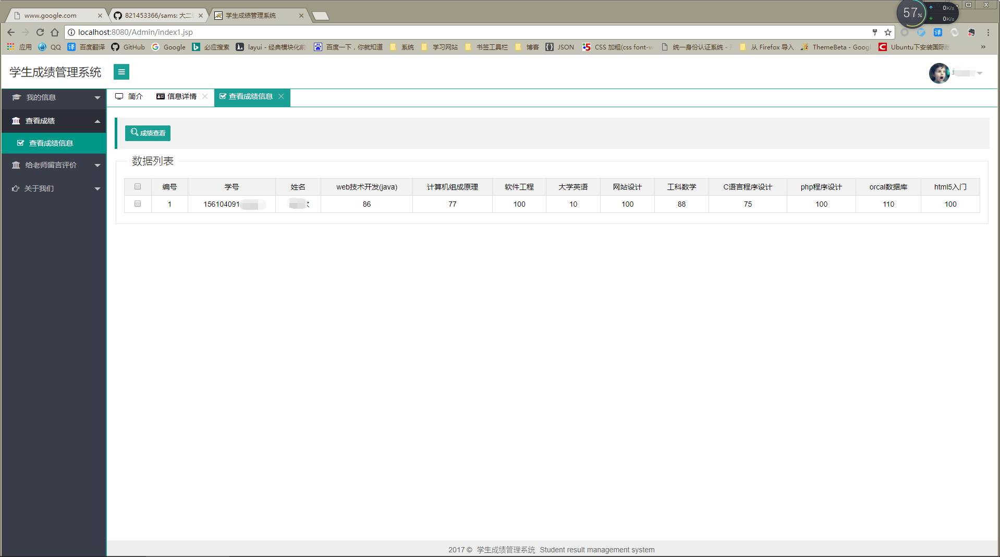
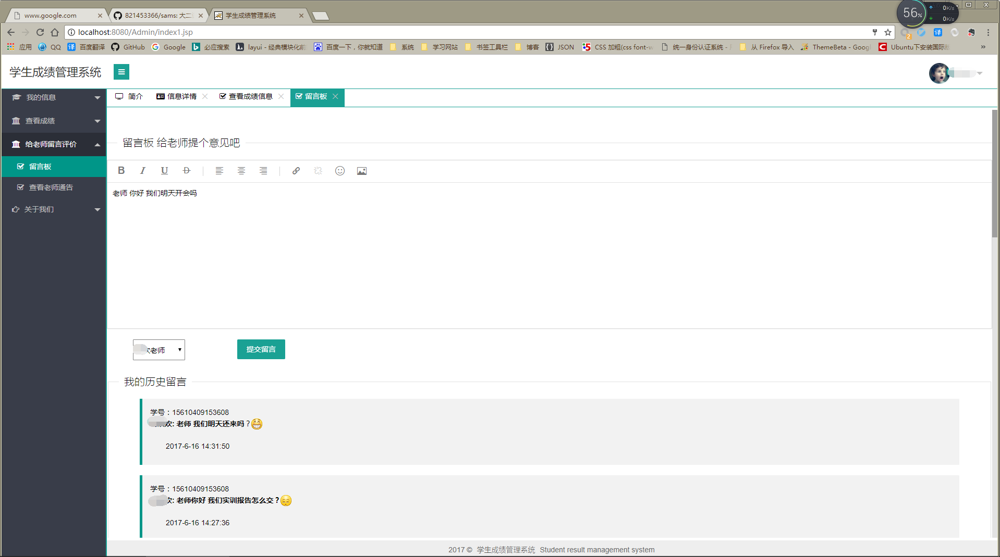
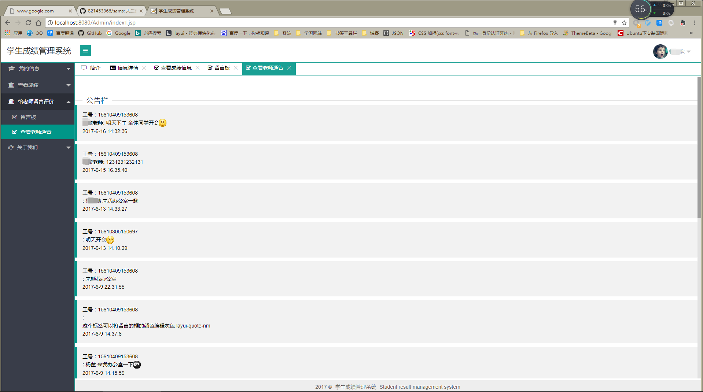

> **老师登陆界面**  

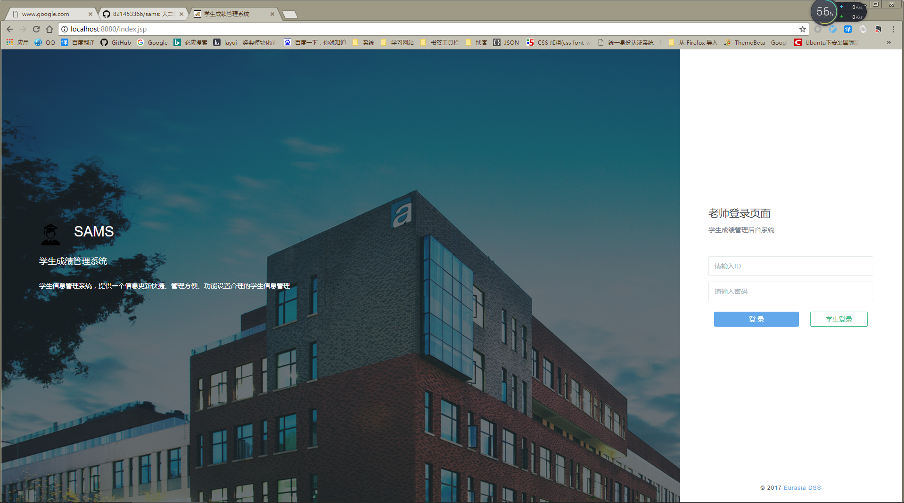

> **老师操作界面：**

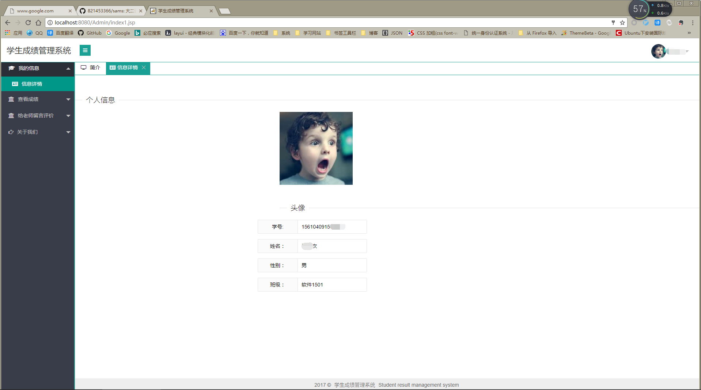
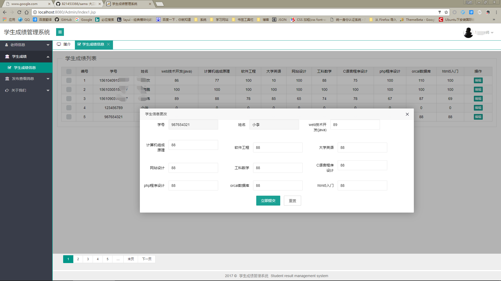
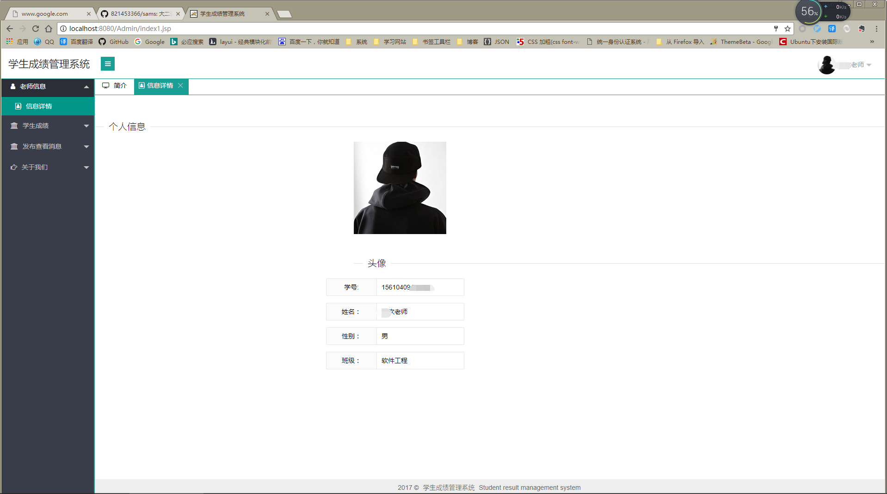
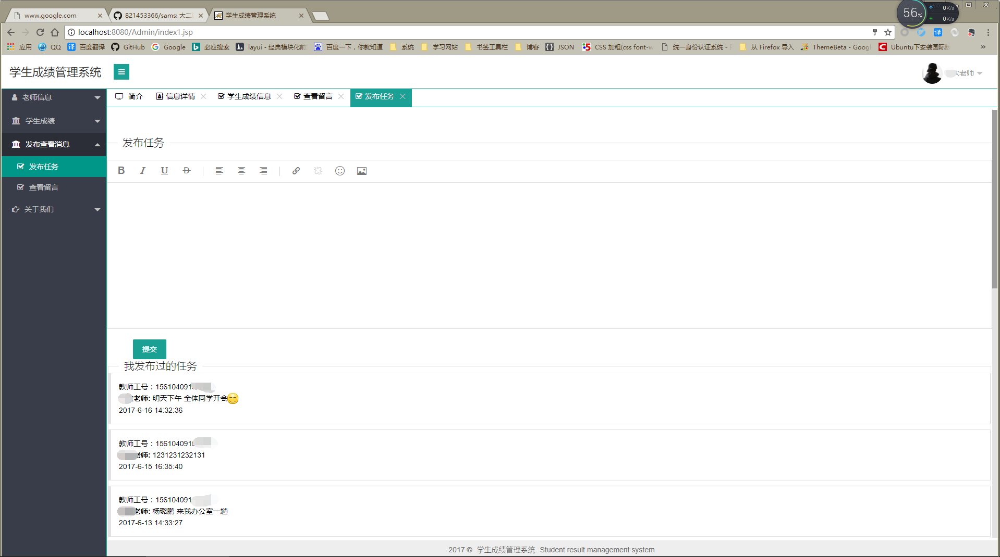

> **管理员登陆界面**  

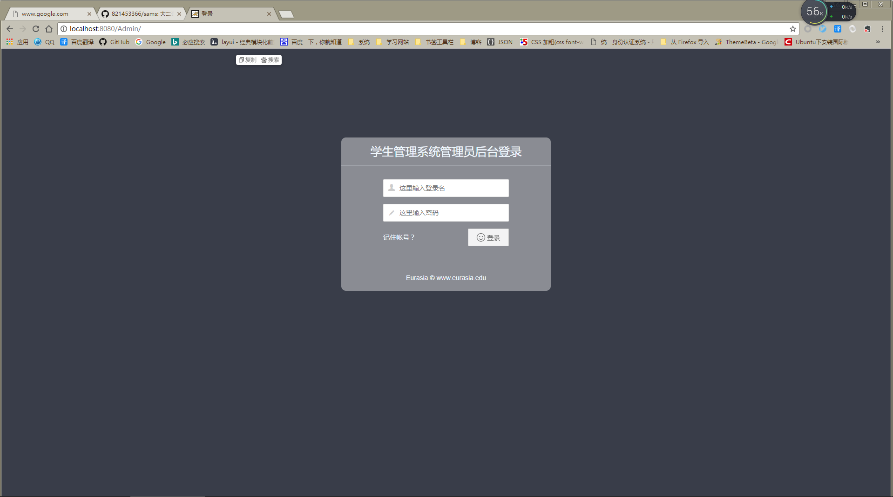

> **管理员操作界面：**

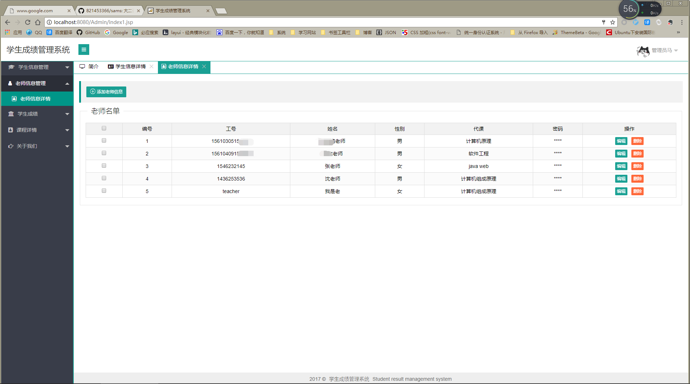
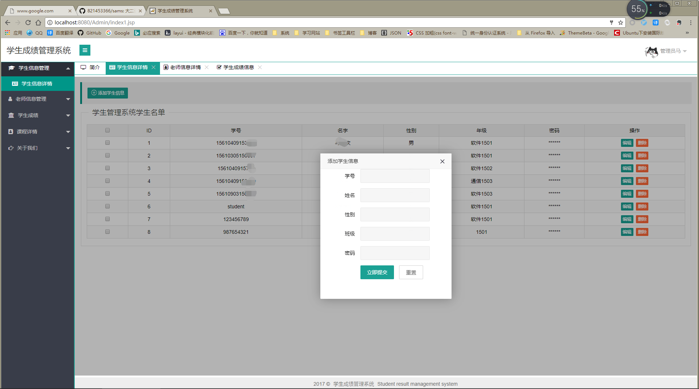
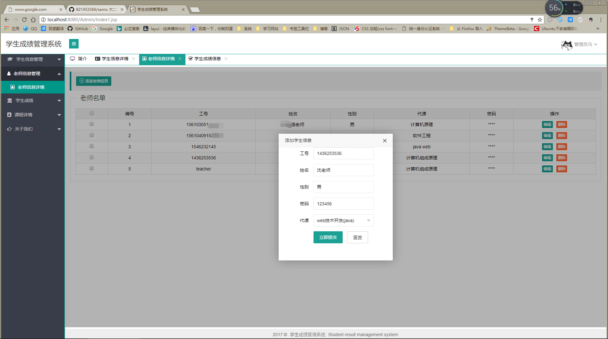

