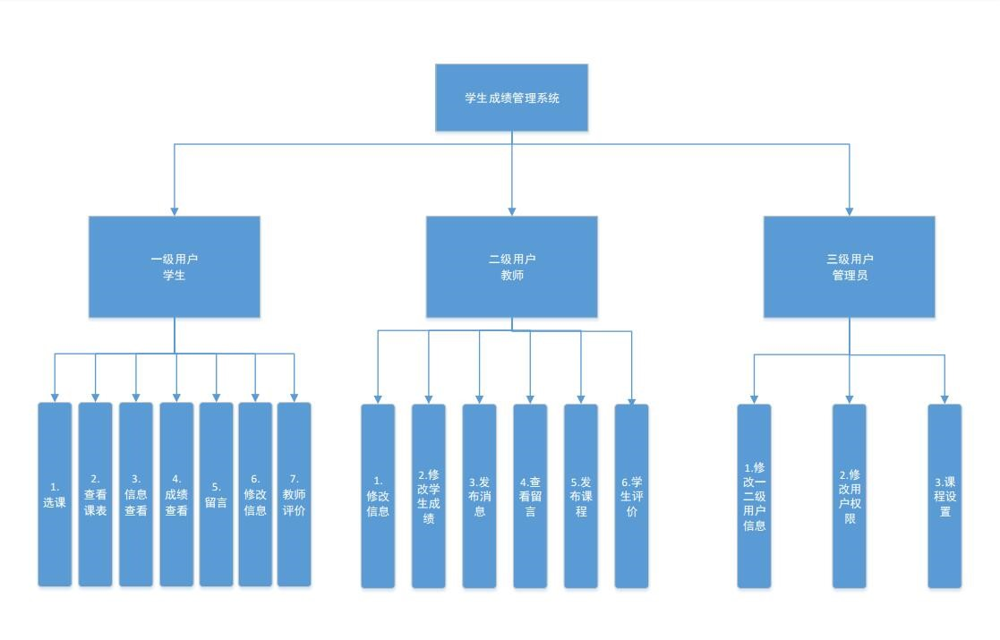

##《学生管理系统》
> ####项目简介:
>学生成绩管理系统通过对教务管理所需的信息管理，把管理人员从繁琐的数据计算中解脱出来，为老师节省了很多时间和精力，提高老师的工作效率，通过学生成绩管理系统给学校管理者减轻工作的负担，将工作的失误几率降低到最低，为广大来时同学带来便利，使信息共享性大大增强。同时这个系统还可以减少人力与管理费用，提供信息准确度更高更简便的学生成绩管理系统。

> ####项目环境及相关配置:
>(1)Tomcat 8.0  
(2)Mysql 5.5  
(3)Layui前端框架  
(4)GitHub项目的托管平台  
(5)IntellijIDEA2017.1.2  
(6)Maven高级项目管理  
